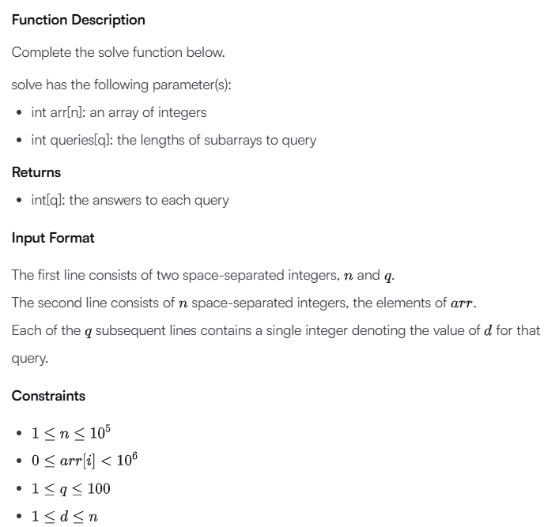

# AI Prompt dan Analisis

## Prompt (Sumber Soal)

Chat Link: <a href="https://chatgpt.com/share/6830478d-2684-8010-8ccf-6d613a7624a5">GPT-4o</a>

  

 

`Berikan Analisis dan kode C nya`

## Arti Soal

Diberikan sebuah urutan bilangan bulat sebanyak`n`, yaitu `A =  {a₀, a₁, ..., aₙ₋₁}`. Kita akan melakukan kueri menggunakan sebuah bilangan bulat, `d`, untuk menghitung hasil dari ekspresi berikut:

<p align="middle"><span style="font-size: 24px; font-weight: bold;">min (max a<sub>j</sub>)</span></p>

<p align="middle">Dengan ketentuan: 0 ≤ i ≤ n-d, i ≤ j < i + d</p>

Dengan kata lain, jika kita definisikan:

`mᵢ = max(aᵢ, aᵢ₊₁, aᵢ₊₂, ..., aᵢ₊d₋₁)`.

Maka yang harus dihitung adalah:

`min(m₀, m₁, ..., mₙ₋d)`.

Diberikan array `arr` dan `q` buah kueri, kembalikan sebuah list berisi jawaban dari masing-masing kueri.

### Contoh

`arr = [2, 3, 4, 5, 6]`
`queries = [2, 3]`

Kueri pertama menggunakan semua subarray dengan panjang `2`:

`[2, 3], [3, 4], [4, 5] [5, 6]`. Maksimum dari tiap subarray adalah `[3, 4, 5, 6]` dan nilai minimum dari itu adalah `3`.

TKueri kedua menggunakan subarray dengan panjang `3`:

`[2, 3, 4], [3, 4, 5], [4, 5, 6]`. Maksimum dari tiap subarray adalah `[4, 5, 6]` dan nilai minimum dari itu adalah `4`.

Hasil: `[3, 4]`.

### Deskripsi Fungsi

Lengkapilah fungsi `solve` seperti berikut:

`solve punya parameter(s) yang berisi:`

- `int arr[n]: an array of integers`
- `int queries[q]: the lengths of subarrays to`

Dan mengembalikan:

`int[q]: the answers to each query`

### Format Masukan

1. `Baris pertama: dua bilangan bulat, `n`dan`q`
2. Baris kedua: `n` bilangan bulat, yaitu isi dari `arr`.
3. `q` baris berikutnya: masing-masing berisi satu bilangan bulat `d` untuk kueri.

### Batasan

- 1 ≤ n ≤ 10⁵
- 0 ≤ arr[i] < 10⁶
- 1 ≤ q ≤ 100
- 1 ≤ d ≤ n

### Contoh Masukan 0

| **STDIN**      | **Meaning**                                 |
| -------------- | ------------------------------------------- |
| 5 5            | n = 5 (jumlah elemen), q = 5 (jumlah kueri) |
| 33 11 44 11 55 | elemen-elemen dari `arr`                    |
| 1              | Nilai kueri pertama (`d = 1`)               |
| 2              | Nilai kueri kedua (`d = 2`)                 |
| 3              | Nilai kueri ketiga(`d = 3`)                 |
| 4              | Nilai kueri keempat (`d = 4`)               |
| 5              | Nilai kueri kelima (`d = 5`)                |

### Contoh Keluaran 0

| **STDOUT** |
| :--------: |
|     11     |
|     33     |
|     44     |
|     44     |
|     55     |

### Penjelasan 0

Untuk `d = 1`, nilainya adalah
min(max(a<sub>0</sub>), max(a<sub>1</sub>), max(a<sub>2</sub>), max(a<sub>3</sub>), max(a<sub>4</sub>)) = 11.

Untuk `d = 2`, nilainya adalah
min(max(a<sub>0</sub>, a<sub>1</sub>), max(a<sub>1</sub>, a<sub>2</sub>), max(a<sub>2</sub>, a<sub>3</sub>), max(a<sub>3</sub>, a<sub>4</sub>)) = 33.

Untuk `d = 3`, nilainya adalah
min(max(a<sub>0</sub>, a<sub>1</sub>, a<sub>2</sub>), max(a<sub>1</sub>, a<sub>2</sub>, a<sub>3</sub>), max(a<sub>2</sub>, a<sub>3</sub>, a<sub>4</sub>)) = 44.

Untuk `d = 4`, nilainya adalah
min(max(a<sub>0</sub>, a<sub>1</sub>, a<sub>2</sub>, a<sub>3</sub>), max(a<sub>1</sub>, a<sub>2</sub>, a<sub>3</sub>, a<sub>4</sub>)) = 44.

Untuk `d = 5`, nilainya adalah
min(max(a<sub>0</sub>, a<sub>1</sub>, a<sub>2</sub>, a<sub>3</sub>, a<sub>4</sub>)) = 55.

## Analisis Masalah:

Diberikan:

- Sebuah array `arr` berisi `n` bilangan bulat.

- `q` buah query, masing-masing berisi integer `d`.

Untuk setiap `d`, kita diminta:

1. Mengambil semua subarray (atau jendela) sepanjang `d` dari array.

2. Menghitung nilai maksimum dari masing-masing subarray tersebut.

3. Mengambil nilai minimum dari semua maksimum tersebut.

### Contoh

`arr = [33, 11, 44, 11, 55]`
`query d = 3`

| Subarray dengan panjang 3 | MAX tiap Subarray | MIN dari semuanya |
| :-----------------------: | :---------------: | :---------------: |
|       [33, 11, 44]        |        44         |                   |
|       [11, 44, 11]        |        44         |                   |
|       [44, 11, 55]        |        55         |                   |
|                           |                   |       `44`       |

### Strategi Solusi

Gunakan Sliding Window Maximum untuk menghitung maksimum tiap jendela ukuran d secara efisien dalam waktu O(n) menggunakan deque.

Untuk setiap query d, lakukan:

1. Jalankan Sliding Window Maximum.

2. Ambil nilai minimum dari hasilnya.

Kode dalam Bahasa C

```
#include <stdio.h>
#include <stdlib.h>

#define MAXN 100005

int arr[MAXN], maxWindow[MAXN], deque[MAXN];
int front, back;

// Fungsi untuk menghitung nilai minimum dari maksimum subarray sepanjang d
int minOfMax(int arr[], int n, int d) {
    front = back = 0;
    int result = 1e9 + 7; // nilai sangat besar sebagai nilai awal minimum

    for (int i = 0; i < n; i++) {
        // Hapus elemen dari belakang yang lebih kecil dari elemen sekarang
        while (back > front && arr[i] >= arr[deque[back - 1]])
            back--;

        deque[back++] = i;

        // Hapus elemen dari depan jika di luar jendela
        if (deque[front] <= i - d)
            front++;

        // Setelah jendela pertama terbentuk
        if (i >= d - 1)
            if (arr[deque[front]] < result)
                result = arr[deque[front]];
    }

    return result;
}

int main() {
    int n, q;
    scanf("%d %d", &n, &q);

    for (int i = 0; i < n; i++)
        scanf("%d", &arr[i]);

    for (int i = 0; i < q; i++) {
        int d;
        scanf("%d", &d);
        printf("%d\n", minOfMax(arr, n, d));
    }

    return 0;
}
```

### Kompleksitas Waktu

- Setiap query d diselesaikan dalam O(n) menggunakan deque.

- Total kompleksitas: O(q \* n), tapi karena q ≤ 100, ini masih efisien.
